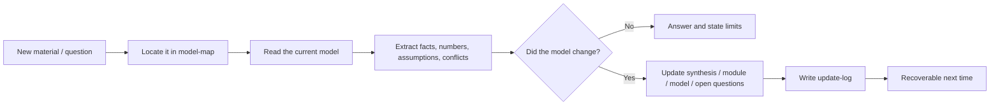
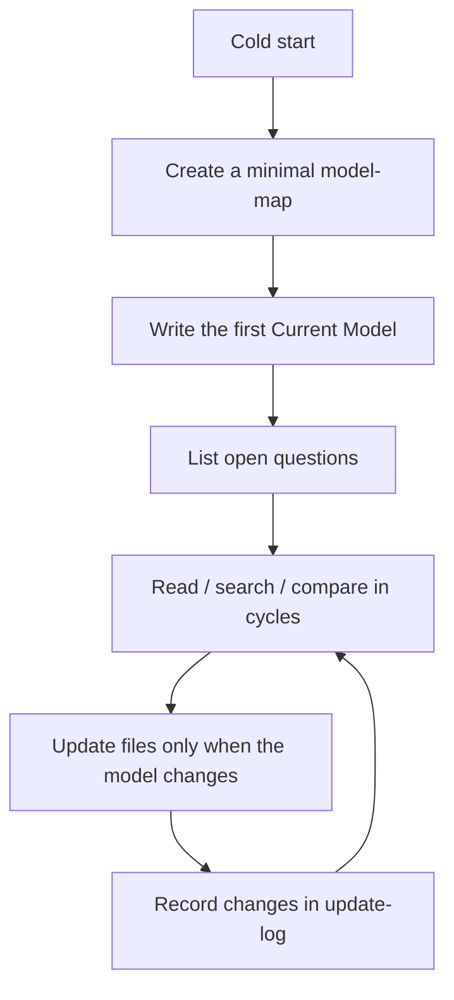

# Progressive Investment Research

An agent skill for long-running research: it keeps scattered materials, judgments, numbers, and open questions organized as a recoverable and auditable research model.

[中文 README](README.md)

## What It Is

Much research is not a one-off report. It is an evolving judgment system. You read a source today, add numbers tomorrow, and discover a conflict next week. If those changes live only in chats, search results, and temporary documents, every continuation starts half-lost.

Progressive Investment Research maintains the work as a dossier:

- `current-synthesis.md` keeps the current model, so humans and agents can recover the state quickly.
- `model-map.md` records the research boundary, analysis axes, modules, and open questions.
- `modules/` stores evidence modules, conceptual frameworks, audits, and registries.
- `models/` stores formulas, assumptions, scenarios, and reproducible reasoning.
- `open-questions.md` separates active questions, closed-for-now monitors, and watchlist items.
- `update-log.md` records why the model changed.

It is useful for investment research, industry research, company research, technology mapping, and any complex question that keeps evolving.

## How It Works



The core idea is simple: do not turn everything into one ever-growing report. Keep the research split into recoverable state, traceable evidence, and reproducible models.

## Create A Research Workspace

After installation, run this where you want to keep the dossier:

```powershell
python scripts/scaffold_dossier.py "./my-topic" --title "My Topic"
```

This creates a minimal workspace:

```text
my-topic/
  context.md
  current-synthesis.md
  model-map.md
  open-questions.md
  update-log.md
  modules/
```

Then ask the agent to work from that directory:

```text
Use progressive-investment-research and continue ./my-topic.
First read current-synthesis.md and model-map.md, then tell me the current model and the next highest-value question.
```

Validate the workspace:

```powershell
python scripts/validate_dossier.py "./my-topic" --strict
```

Print a simple index:

```powershell
python scripts/regenerate_index.py "./my-topic" --stdout
```

## Recommended Workflow



Good prompts:

- "Continue this dossier and recover the current model first."
- "Absorb this source, but do not change the conclusion yet; tell me which module it affects."
- "Before adding this number to the model, check its source, definition, date, and whether it is reproducible."
- "Which questions are active, and which are only monitors?"
- "At the end of this round, update Current Model and update-log."

## How To Use The Files

| File / directory | Purpose | Update when |
| --- | --- | --- |
| `context.md` | Workspace entry, scope, continuation protocol | Cold start, scope change, continuation rule change |
| `current-synthesis.md` | Current model and human recovery entry | Conclusion or key uncertainty changes |
| `model-map.md` | Research boundary, axes, module map | Research structure changes |
| `open-questions.md` | Active / monitor / watchlist state | Question state changes |
| `update-log.md` | Model change log | After each material update |
| `modules/` | Evidence, frameworks, audits, registries | A topic needs stable storage |
| `models/` | Calculation models, scenarios, formulas | Reasoning depends on numbers or sensitivity |
| `companies/` | Company watchlist cards | Research moves to company-level tracking |
| `data/` | Canonical rows / CSV | A model needs structured data |
| `archive/` | Historical material outside the default read path | Active surface needs compression |

## Install

Copy this repository into your agent's skill/plugin directory, or point the runtime at this folder.

For Codex-style loading, the folder contains:

- `SKILL.md`
- `.codex-plugin/plugin.json`
- `references/`
- `templates/`
- `scripts/`

For Claude-style loading, it also includes:

- `.claude-plugin/plugin.json`
- `agents/`

## Dependencies And Fallback

The core skill only requires an agent that can read and write files. The helper scripts in `scripts/` use only the Python standard library.

External search, browsers, URL extraction, PDF/Office parsing, AnySearch, web-access, markitdown, and similar tools are accelerators. If they are unavailable, the research can still continue:

1. Use whatever search, browser, or file-reading capability the current runtime provides.
2. Record the source, permission status, and acquisition method in a Source Card or module.
3. Treat search summaries, secondary material, and unverified numbers as source leads, not model facts.

## Example

`fixtures/ai-industry-chain-mini/` is a sanitized mini dossier that demonstrates how the skill works. It is not investment advice and not a complete research database.

Try:

```text
Use progressive-investment-research and read fixtures/ai-industry-chain-mini.
Explain what Current Model, Model Map, and Open Questions each do.
```

## Tests

Run the lightweight contract tests:

```powershell
python tests/test_contract.py
```

The tests use only the Python standard library.

## License

MIT. See `LICENSE`.
